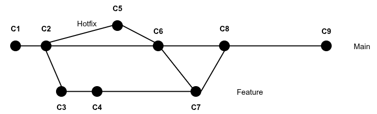

# PJP PAC 1

Aquesta PAC consta d'unes preguntes teòriques sobre GitHub i d'uns exercicis pràctics en JavaScript.

## Competències

En aquesta PAC es desenvolupen les següents competències del Màster:

- [CB10] Que els estudiants obtinguen les habilitats d'aprenentatge que els permetin continuar estudiant d'una manera que haurà de ser en gran manera autodirigida o autònoma.
- [CG1] Analitzar i sintetitzar informació tècnica complexa.
- [CE3] Utilitzar de manera adequada els llenguatges de programació i les millors eines de desenvolupament per a l'anàlisi, el disseny i la implementació de llocs i aplicacions web en funció de les necessitats del projecte.
- [CE8] Adaptar-se a les tecnologies web i als futurs entorns actualitzant les competències professionals.

## Objectius

Els objectius d'aquesta PAC són:

- Comprendre la configuració d'un entorn de treball per desenvolupar aplicacions en JavaScript.
- Conèixer i saber utilitzar les ordres bàsiques de Git.
- Conèixer i saber utilitzar GitHub i les principals tasques col·laboratives de la plataforma.
- Revisar el nivell previ de programació.
- Posar en pràctica coneixements bàsics de JavaScript.

## Entrega de la PAC

Un cop realitzades les activitats pràctiques proposades en aquest enunciat, el lliurament es realitzarà enviant els teus canvis a l'apartat de l'aula virtual de la UOC.

## Puntuació

El fet de treballar amb tests per verificar la funcionalitat del codi us permetrà tenir una idea de la vostra pròpia nota abans del lliurament.

La puntuació dels exercicis pràctics es basa en dos criteris: **funcionalitat** i **implementació**. S’espera que els exercicis funcionin correctament (passin els tests) i que la implementació (el codi) tingui una qualitat adequada.

Alguns detalls a tenir en compte:

- Es penalitzarà qualsevol intent de hardcodejar els tests per forçar que passin. Aquesta tècnica consisteix a canviar la implementació perquè retorni únicament el valor esperat pel test (qualsevol altre test fallaria).
- Els tests automàtics estan dissenyats per detectar exercicis erronis o incomplets per a casos concrets. El fet que un test passi no garanteix que l’exercici estigui realitzat correctament, és a dir, que cobreixi tots els casos.
- Un exercici els tests del qual no passen es puntuarà amb un 0 llevat que existeixin problemes amb el test.
- A més de passar els tests, el professorat avaluarà el vostre codi en base als criteris següents:
  - Llegibilitat, senzillesa i qualitat del codi.
  - Coneixements de programació. Per exemple, no utilitzar les estructures de control adequades, com utilitzar un bucle per construir una sentència condicional.

## Requisits mínims

- Tenir instal·lat Visual Studio Code (o qualsevol altre IDE).
- Coneixements bàsics de Git i GitHub (Activitats 2 i 3 del Repte 1).
- Coneixements bàsics de programació (Requisit de l’assignatura).

## Preguntes Teòriques (7 punts)
Hauràs de respondre aquestes preguntes al fitxer `src/pec1/pec1.md`.

### Exercici T1 (5 punts)
La imatge següent mostra un escenari de desenvolupament col·laboratiu a GitHub:


A la part central pots veure el repositori a GitHub en el seu estat inicial.

En un primer moment, els desenvolupadors 1 i 2 (`dev1` i `dev2`) ja tenen el repositori en el seu entorn de treball local.
Tots dos fan canvis **de manera simultània** als fitxers que s’indiquen a la imatge i volen compartir-los amb la resta de desenvolupadors. **El desenvolupador 1 (`dev1`) comparteix els seus canvis en primer lloc** i, després, ho fa el desenvolupador 2 (`dev2`).

Finalment (git pull) s’**incorpora** el desenvolupador 3, que necessita unir-se al projecte per modificar el fitxer que està indicat a la imatge i, després de fer-ho, compartir els canvis amb la resta de desenvolupadors.

Tots treballen sobre la mateixa branca `main` que està configurada com a branca per defecte.

**T1.1 (3,5 punts)**: Quin és l’ordre de comandes que ha de realitzar cadascun dels 3 desenvolupadors per dur a terme l’acció que necessiten fer? Explica breument el flux de cadascun dels desenvolupadors i per què aquest és l’ordre que han d’utilitzar.

**T1.2 (1,5 punts)**: Pot haver-hi algun conflicte en algun moment? Indica, si n’hi ha, on, i com i qui ha de procedir per resoldre’l.

### Exercici T2 (2 punts)

La figura següent mostra un escenari de l’evolució d’un repositori col·laboratiu:



En aquest, es presenten tres branques. La branca principal (`main`) que és la branca per defecte. A més, s’han creat dues branques en moments diferents del desenvolupament, una anomenada `Feature` i una altra anomenada `Hotfix`. Aquest escenari és un cas habitual en entorns col·laboratius on s’ha de resoldre un `bug` en producció mentre s’està desenvolupant una nova funcionalitat.

L’ordre dels commits és un ordre cronològic, és a dir, C1 es produeix abans que C2, que es produeix abans que C3, etc.

Respon les preguntes següents:
* **(0,5 punts)** El contingut de quins commits conté el commit C6?
* **(0,5 punts)** El contingut de quins commits conté el commit C7?
* **(1 punt)** Es pot donar un conflicte? En quin punt? Explica els motius.

## Exercicis pràctics (3 punts)

Per realitzar els exercicis pràctics t'has de dirigir al fitxer `src/pec1/pec1.js`.

En aquest fitxer hauràs de definir les funcions que t'indiquem als exercicis que veuràs més avall.

D'altra banda, els tests que et permetran saber si la solució que proposes per als exercicis és correcta són al fitxer `src/pec1/pec1.test.js`.
**No has d'editar aquest fitxer (ni cap altre que no se t'indiqui expressament)**.
Tingues en compte que els tests són condicions que han de complir les funcions que implementaràs en els exercicis, per la qual cosa et poden servir d'ajuda per corregir-los.

### Preparant l’entorn (0 punts)

En primer lloc, assegura’t que tens instal·lats:

- [Node.js](https://nodejs.org/es/)
- [VSCode](https://code.visualstudio.com/)
- [Git](https://git-scm.com/)

#### Instal·la les dependències del projecte

```
npm install
```

Recorda que cal estar situat a la carpeta arrel del projecte.

#### Executa els tests

```
npm t
```

La instrucció anterior llançarà els tests cada vegada que desis el fitxer `src/pec1/pec1.js`, que és precisament on implementaràs els exercicis d’aquesta PAC.

Com pots esperar, la primera vegada que executis `npm t` i es llancin els tests, fallaran tots, ja que no hi ha cap exercici implementat. Revisa el missatge d’error que s’imprimeix per conèixer el seu format i entendre com es notifiquen els errors.

Aquest és un exemple d’una possible sortida d’error:

```
  ● ex2 › should calculate the area of a circle

  expect(received).toBeCloseTo(expected, precision)

  Expected: 3.141592653589793
  Received: 3.14

  Expected precision:    5
  Expected difference: < 0.000005
  Received difference:   0.0015926535897929917
```

És important fixar-se en la descripció de l’error; per exemple, el text d’error anterior indica que s’espera 3.141592653589793 i s’està retornant 3.14, que, donada la precisió marcada, és un nombre incorrecte.

```
 PASS  src/pec1/pec1.spec.js
  ex1
```

Ara el test mostra `PASS` i el cas de prova que abans fallava es mostra com a correcte (amb el caràcter `√`).

L’entorn de proves té un menú (accessible mitjançant la tecla `w`) que us permet executar els tests selectivament. Per exemple, prement `a` podeu rellançar manualment tots els tests; i prement `f` podeu rellançar només aquells tests que han fallat. Proveu les diferents opcions i si teniu algun dubte, consulteu-lo al fòrum de l’assignatura.

### Exercici P1 (1,5 punts)

Implementa una funció `ex1` que calculi el perímetre (longitud) d’una circumferència a partir del seu radi.

La funció rebrà el paràmetre següent:
* `r`: Representa el radi de la circumferència. És un valor numèric.

La funció retornarà el perímetre de la circumferència aplicant la fórmula `P = 2 * π * r`.

### Exercici P2 (1,5 punts)

Implementa una funció `ex2` que calculi l’àrea d’un cercle a partir del seu radi.

La funció rebrà el paràmetre següent:
* `r`: Representa el radi del cercle.

La funció retornarà l’àrea del cercle aplicant la fórmula `A = π * r^2`.

**Notes per a P1 i P2:**
* No es tindran en compte els valors negatius de `r`.
* Pots accedir a la constant π mitjançant `Math.PI`. 
