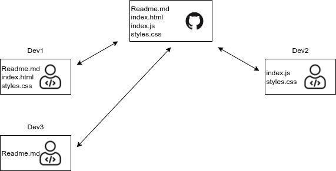
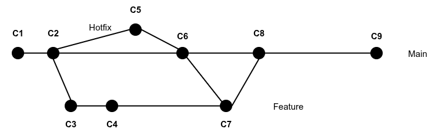

# PJP PEC 1

Esta PEC consta de en unas preguntas teóricas sobre GitHub y de unos ejercicios prácticos en JavaScript.

## Competencias

En esta PEC se desarrollan las siguientes competencias del Máster:

- [CB10] Que los estudiantes posean las habilidades de aprendizaje que les permitan continuar estudiando de una manera que tendrá que ser en gran medida autodirigida o autónoma.
- [CG1] Analizar y sintetizar información técnica compleja.
- [CE3] Utilizar de manera adecuada los lenguajes de programación y las mejores herramientas de desarrollo para el análisis, el diseño y la implementación de lugares y aplicaciones web en función de las necesidades del proyecto.
- [CE8] Adaptarse a las tecnologías web y a los futuros entornos actualizando las competencias profesionales.

## Objetivos

Los objetivos de esta PEC son:

- Comprender la configuración de un entorno de trabajo para el desarrollo de aplicaciones en JavaScript.
- Conocer y saber utilizar los comandos básicos de Git.
- Conocer y saber utilizar GitHub y las principales tareas colaborativas de la plataforma.
- Revisar el nivel previo de programación.
- Poner en práctica conocimientos básicos de JavaScript.

## Entrega de la PEC

Una vez hayas realizado las actividades prácticas propuestas en este enunciado, la entrega se realizará enviando tus cambios al apartado del aula virtual de la UOC.

## Puntuación

El hecho de trabajar con tests para verificar la funcionalidad del código os permitirá tener una idea de vuestra propia nota antes de la entrega. 

La puntuación de los ejercicios prácticos se basa en dos criterios: **Funcionalidad** e **implementación**. Se espera que los ejercicios funcionen correctamente (pasen los tests) y que la implementación (el código) tenga una calidad adecuada. 

Algunos detalles a tener en cuenta:

- Se penalizará cualquier intento de _hardcodear_ los tests para forzar que pasen. Esta técnica consiste en cambiar la implementación para que devuelva únicamente el valor esperado por el test (cualquier otro test fallaría).
- Los tests automáticos están diseñados para detectar ejercicios erróneos o incompletos para casos concretos. El hecho de que un test pase no garantiza que el ejercicio esté realizado correctamente, es decir, que cubra todos los casos.
- Un ejercicio cuyos tests no pasan se puntuará con un 0 salvo que existan problemas con el test.
- Además de pasar los tests, el profesorado evaluará vuestro código en base a los siguientes criterios:
  - Legibilidad, sencillez y calidad del código.
  - Conocimientos de programación. Por ejemplo, no utilizar las estructuras de control adecuadas, como utilizar un bucle para construir una sentencia condicional o viceversa.

## Requisitos mínimos

- Tener instalado Visual Studio Code (o cualquier otro IDE).
- Conocimientos básicos de Git y GitHub (Actividades 2 y 3 del Reto 1).
- Conocimientos básicos de programación (Requisito de la asignatura).

## Preguntas Teóricas (7 puntos)
Deberás responder a estas preguntas en el fichero `src/pec1/pec1.md`.

### Ejercicio T1 (5 puntos)
La siguiente imagen muestra un escenario de desarrollo colaborativo en GitHub:



En la parte central puedes ver el repositorio en github en su estado inicial.

En un primer momento, los desarrolladores 1 y 2 (`dev1` y `dev2`) ya tienen el repositorio en su entorno de trabajo local.
Ambos realizan cambios **de forma simultanea** en los ficheros que se indican en la imagen y quieren compartirlos con el 
resto de desarrolladores. **El desarrollador 1 (`dev1`) comparte sus cambios en primer lugar** y, después, lo hace el 
desarrollador 2 (`dev2`).

Por último (  * git pull) se **incorpora** el desarrollador 3, que necesita unirse al proyecto para modificar 
el fichero que está indicado en la imagen y, tras hacerlo, compartir los cambios con el resto de desarrolladores.

Todos trabajan sobre la misma rama `main` que está configurada como rama por defecto.

**T1.1 (3.5 puntos)**: ¿Cuál es el orden de comandos que debe realizar cada uno de los 3 desarrolladores para realizar la acción que necesitan
hacer? Explica brevemente el flujo de cada uno de los desarrolladores y por qué ese es el orden que deben de utilizar.

**T.1.2 (1.5 puntos)**: ¿Puede haber algún conflicto en algún momento? Indica, si lo hay, dónde, y cómo y quién debe proceder para resolverlo.

### Ejercicio T2 (2 puntos)


La siguiente figura muestra un escenario de la evolución de un repositorio colaborativo:



En él, se presentan tres ramas. La rama principal (`main`) que es la rama por defecto. Además, se han creado dos ramas
en momentos distintos del desarrollo, una llamada `Feature` y otra llamada `Hotfix`. Este escenario es un caso habitual
en entornos colaborativos donde se ha de resolver un `bug` en producción mientras que se está desarrollando una nueva
funcionalidad.

El orden de los commits es un orden cronológico, es decir, C1 se produce antes que C2, que se produce antes que C3, etc.

Responde a las siguientes preguntas: 
* **(0.5 puntos)** ¿El contenido de qué commits contiene el commit C6? 
* **(0.5 puntos)** ¿El contenido de qué commits contiene el commit C7?
* **(1 punto)** ¿Se puede dar un conflicto? ¿En qué punto? Explica los motivos.


## Ejercicios prácticos (3 puntos)

Para realizar los ejercicios prácticos debes dirigirte al fichero `src/pec1/pec1.js`

En este fichero deberás definir las funciones que te indicamos en los ejercicios que verás más abajo.

Por otro lado, los tests que te permitirán saber si la solución que propones para los ejercicios es correcta están en el fichero `src/pec1/pec1.test.js`.
**No debes editar este fichero**.
Ten en cuenta que los tests son condiciones que deben cumplir las funciones que implementarás en los ejercicios, por lo que pueden servirte de ayuda para corregirlos.

### Preparando el entorno (0 puntos)

En primer lugar, asegúrate de que tienes instalados:

- [Node.js](https://nodejs.org/es/)
- [VSCode](https://code.visualstudio.com/)
- [Git](https://git-scm.com/)

#### Instala las dependencias del proyecto

```
npm install
```

Recuerda que es necesario estar situado en la carpeta raíz del proyecto.

#### Ejecuta los tests

```
npm t
```

La instrucción anterior lanzará los tests cada vez que guardes el fichero `src/pec1/pec1.js`, que es precisamente donde implementarás los ejercicios de esta PEC.

Como puedes esperar, la primera vez que ejecutes `npm t` y se lancen los tests, fallarán todos, ya que no hay ningún ejercicio implementado. Revisa el mensaje de error que se imprime para conocer su formato y entender cómo se notifican los errores.

Este es un ejemplo de una posible salida de error:

```
  ● ex2 › should calculate the area of a circle

    expect(received).toBeCloseTo(expected, precision)

    Expected: 3.141592653589793
    Received: 3.14

    Expected precision:    5
    Expected difference: < 0.000005
    Received difference:   0.0015926535897929917

```

Es importante fijarse en la descripción del error, por ejemplo, el texto de error anterior indica que se espera 3.141592653589793 y se está devolviendo 3.14, que dada la precisión marcada es un número incorrecto.

```
 PASS  src/pec1/pec1.spec.js
  ex1
```

Ahora el test muestra `PASS` y el caso de prueba que antes fallaba se muestra como correcto (con el carácter `√`).

El entorno de pruebas tiene un menú (accesible mediante la tecla `w`) que os permite ejecutar los tests selectivamente. Por ejemplo, pulsando `a` podéis relanzar manualmente todos los tests; y pulsando `f` podéis relanzar solamente aquellos tests que han fallado. Probad las diferentes opciones y si tenéis alguna duda, consultadla en el foro de la asignatura.

### Ejercicio P1 (1,5 puntos)

Implementa una función `ex1` que calcule el perímetro (longitud) de una circunferencia a partir de su radio.

La función recibirá el siguiente parámetro:
* `r`: Representa el radio de la circunferencia. Es un valor numérico.

La función devolverá el perímetro de la circunferencia aplicando la fórmula `P = 2 * π * r`.

### Ejercicio P2 (1,5 puntos)

Implementa una función `ex2` que calcule el área de un círculo a partir de su radio.

La función recibirá el siguiente parámetro:
* `r`: Representa el radio del círculo.

La función devolverá el área del círculo aplicando la fórmula `A = π * r^2`.

**Notas para P1 y P2:**
* No se tendrán en cuenta los valores negativos de `r`.
* Puedes acceder a la constante π mediante `Math.PI`.
